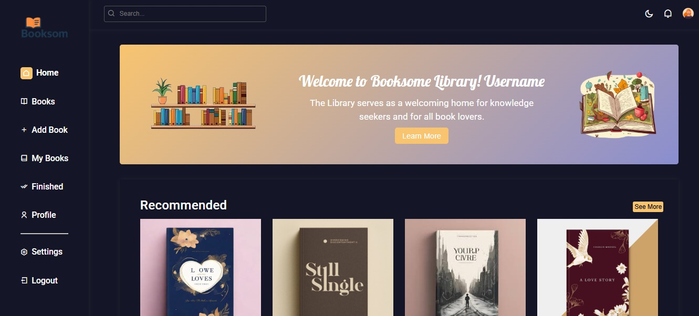
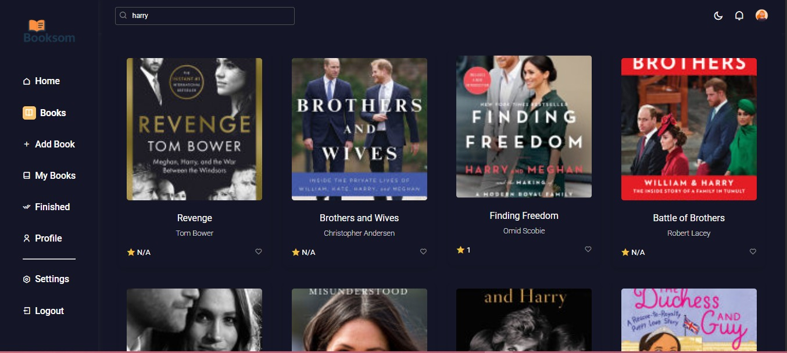
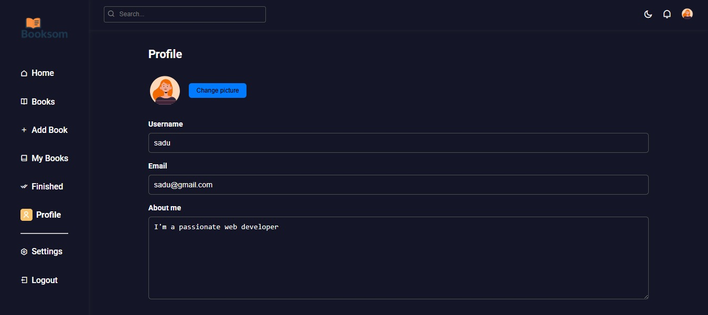

## 📚 Booksome Library

**Booksome Library** is a modern web app that helps users browse, search, and manage books. Built using HTML, CSS, and JavaScript, the app fetches data from the Google Books API and allows users to manage their reading progress using `localStorage`.

🔗 **Live Demo:** [booksome-library.vercel.app](https://booksome-library.vercel.app/pages/dashboard.html)

---

### 🚀 Features

* 🔍 Search books by subject using the Google Books API
* 📖 View book covers, titles, authors, and ratings
* ✅ Add books to your personal list
* 📘 Mark books as finished
* ❤️ Interactive and clean UI
* 🌙 Light/Dark mode toggle
* 📱 Responsive design for all devices
* 🧠 Simple login with localStorage (no backend)

---

### 📸 Screenshots

| Dashboard                                        | Books Page                               | Profile                                      |
| ------------------------------------------------ | ---------------------------------------- | -------------------------------------------- |
|  |  |  |

---

### 🛠 Tech Stack

* **Frontend:** HTML5, CSS3, JavaScript
* **API:** Google Books API
* **Icons:** RemixIcon, Font Awesome
* **Hosting:** Vercel

---

### 📂 Folder Structure

```
📆booksome-library
 ├ 📁assets
 ┃ ├ 📁css
 ┃ └ 📁images
 ├ 📁js
 ├ 📁pages
 ├ 📄index.html
 └ 📄README.md
```

---


1. **Open with Live Server (or just open index.html in a browser)**

---

### ⚠️ Known Limitations

* No user authentication (uses only localStorage)
* Book details are limited to what's available via the API

---


### 🙇‍♀️ About the Developer


**Sadia** — Computer Science student & aspiring full-stack developer from Somalia 🇸🇴.
Loves building web apps, solving problems, and learning new technologies.

> “This is one of my first full projects — I’m so proud of what I’ve learned!”

📨 Contact me on [LinkedIn](https://www.linkedin.com/in/sadia-mohamoud)
